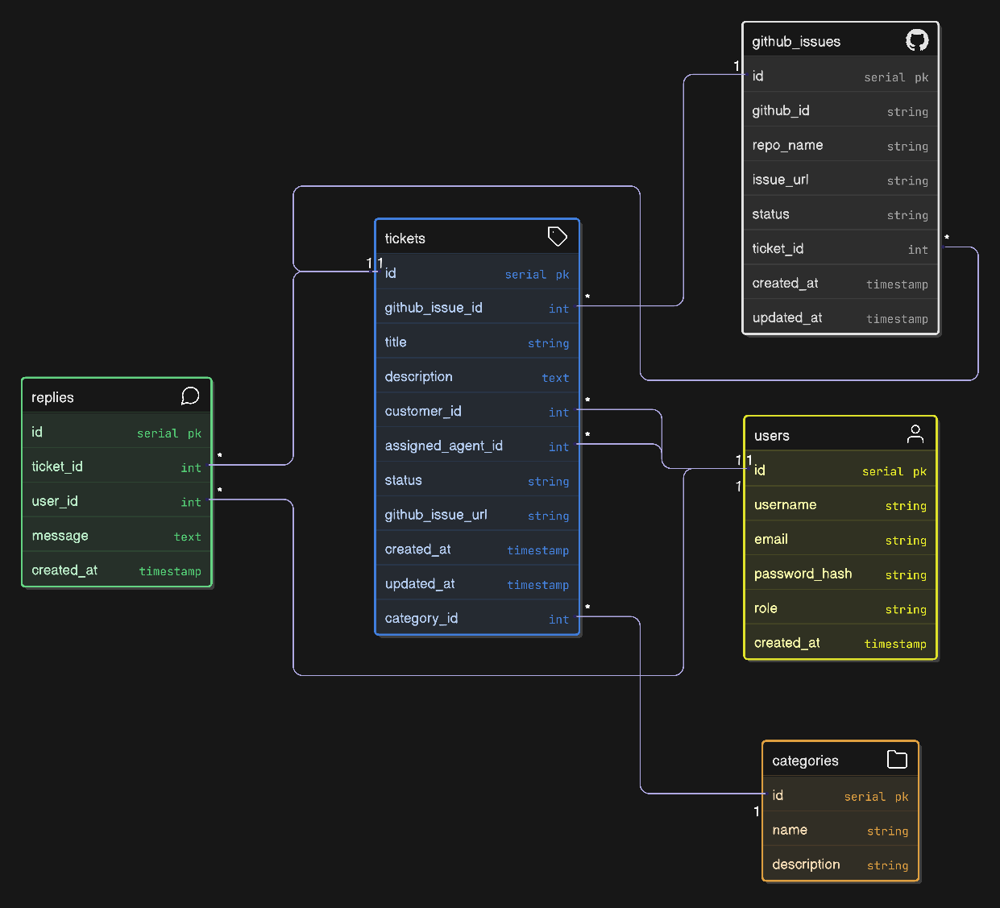

# 🛠️ Support Ticketing System with GitHub Integration

A full-stack support system that allows customers to create support tickets, support agents to manage them, and admins to oversee all operations. Each ticket is automatically synced with a GitHub issue for tracking, resolution, and collaboration.

---

## Features

### Customer
- Register and login
- Create support tickets (title, description, category)
- Automatically creates GitHub issues on ticket submission
- View own tickets and replies
- Track ticket status and GitHub issue link

### Agent
- View assigned tickets
- Add replies to tickets
- Update ticket status (`Open`, `In Progress`, `Resolved`)
- Automatically closes GitHub issue when ticket is resolved

### Admin
- View and manage all tickets
- Assign tickets to agents
- Update ticket status manually
- View dashboard stats (Open vs Resolved, Category breakdown)
- Close both ticket and GitHub issue directly from admin panel

---

## ⚙️ Tech Stack

| Layer | Technology |
|-------|------------|
| Backend | Node.js, Express.js |
| Database | MongoDB (via Mongoose) |
| Templating | EJS |
| Session Management | express-session + connect-mongo |
| Auth | bcryptjs, express-session |
| GitHub Integration | GitHub REST API v3 via Axios |
| Hosting (optional) | Railway |

---

## 📄 Schema Relation



---

## 💻 Local Development Setup

Follow these steps to run the project locally:

---

### Clone the Repository

```bash
git clone https://github.com/Irshad-Ahmaed/support-ticket-system
cd support-ticket-system
npm install
```

### 📄 Environment Variables

Create a `.env` file in the root:

```env
PORT=3000
MONGO_URI=your_mongodb_atlas_connection
SESSION_SECRET=yourSecretKey
GITHUB_TOKEN=ghp_xxxxxxxx
GITHUB_REPO=yourusername/support-ticket-system
```

### Start the Application
```sh
npm run dev
```

- Once started, visit: http://localhost:3000